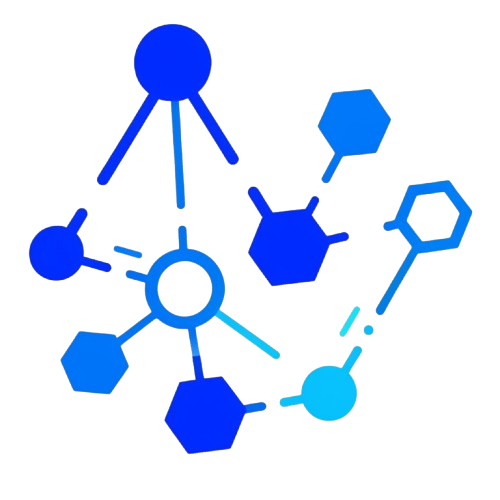
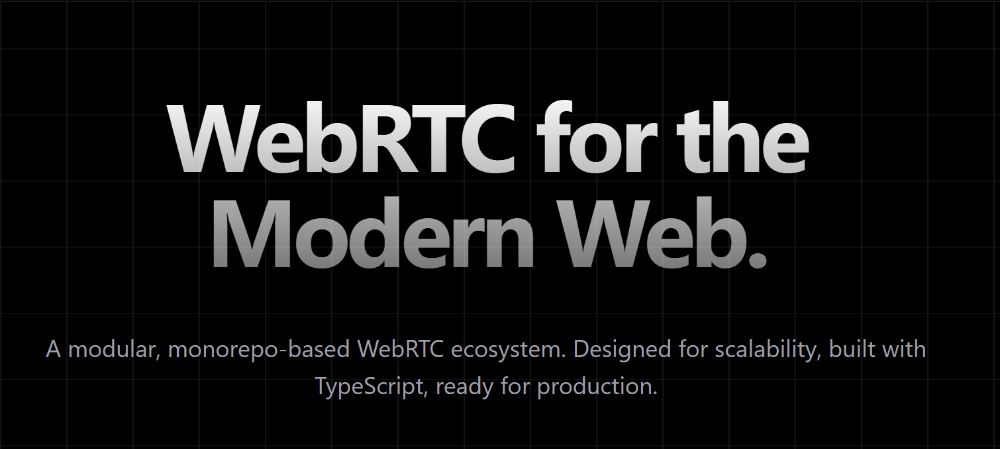

#  Connexify




**Connexify** is a modular WebRTC ecosystem built as a monorepo. It features a lightweight SDK, a dedicated core hardware layer, and a signaling service that enables real-time video calling in the browser using **WebRTC's peer-to-peer (P2P) mesh architecture**.

Designed with **TypeScript** project references, it strictly separates business logic (`core-sdk`) from browser APIs (`webrtc-core`) and shared types, making it a scalable foundation for building real-time communication apps.

---

## 🏗️ Project Structure

This project is organized as a monorepo to ensure modularity and separation of concerns:

```text
connexify/
├── apps/
│   ├── signaling-server/    # Node.js + Socket.IO signaling backend
│   └── demo/                # Vite + Vanilla TS frontend (consumer of the SDK)
├── packages/
│   ├── types/               # Shared TypeScript interfaces (Contract layer)
│   ├── utils/               # Shared helper functions
│   ├── webrtc-core/         # Low-level wrappers for RTCPeerConnection & Media (Hardware layer)
│   └── core-sdk/            # High-level Client SDK (Business Logic layer)
└── README.md
```

## 🚀 Current Capabilities

* **✅ Modular Architecture:** Clean separation between types, hardware abstraction, and client SDK logic.
* **✅ P2P Mesh Topology:** Supports 1:1 and small group video calls using native WebRTC.
* **✅ Event-Driven SDK:** The `ConnexifyRTCClient` handles signaling events (`offer`, `answer`, `ice-candidate`) automatically.
* **✅ Automatic Stream Handling:** Manages local media capture and remote stream mapping internally.
* **✅ Hot-Pluggable Signaling:** Uses Socket.io, but the logic is decoupled enough to swap protocols if needed.
* **✅ Vite Proxy Support:** The demo app is configured to proxy WebSocket connections, eliminating CORS issues during local development.

## ⚠️ Current Drawbacks & Known Issues

While functional, this project is currently in a **Prototype/Alpha** stage. Please be aware of the following limitations:

* **No Room Logic:** The signaling server currently broadcasts `new-peer` events to *all* connected clients. There is no concept of "Rooms," meaning every connected user will try to connect to everyone else.
* **Hardcoded Signaling URL:** The demo application currently relies on a hardcoded URL (e.g., `loca.lt` tunnels) or localhost. This needs to be moved to environment variables for production use.
* **Basic Error Handling:** Most errors currently trigger `alert()` or `console.error`. A production-grade event emitter system for errors is needed.
* **Mesh Scaling Limits:** As this uses a Mesh architecture, performance (CPU/Bandwidth) will degrade significantly beyond 4-5 participants.

---

## 🛠️ Getting Started

### Prerequisites

* Node.js (v18+)
* PNPM (recommended) or NPM

### 1. Installation

Install dependencies for all packages and apps from the root:

```bash
pnpm install
```

## 2. Build Packages
Since this uses TypeScript Project References, you must build the packages before running the apps:

```bash
# Run inside the root directory
pnpm run build --filter "./packages/**"
```


## 3. Run the Signaling Server

```bash
cd apps/signaling-server
pnpm run dev
# Server listens on port 3000 by default
```

## 4. Run the Demo App
```bash
cd apps/demo
pnpm run dev
# Vite runs on port 5173
```

> **Note:** Ensure your `vite.config.ts` is proxying requests to your signaling server port.

## Client SDK Usage

Here is how to use the `@connexify/core-sdk` in your own application:

```typescript
import { ConnexifyRTCClient } from '@connexify/core-sdk';

// 1. Initialize the client
const client = new ConnexifyRTCClient({
  signalingURL: new URL('http://localhost:3000'), // Or your production URL
  constraints: { 
    audio: true, 
    video: true 
  }
});

// 2. Handle incoming remote streams
client.onRemoteStream = (stream, peerId) => {
  console.log(`Received stream from ${peerId}`);
  
  const video = document.createElement('video');
  video.srcObject = stream;
  video.autoplay = true;
  document.body.appendChild(video);
};

// 3. Initialize Socket Listeners
client.socketHandler();

// 4. Start Media and Signaling
// Best practice: Wait for socket connection before starting media
client.socket.on("connect", async () => {
    await client.start(); 
    
    // Attach local stream to your UI
    if (client.localMediaStream) {
        const localVideo = document.getElementById('my-video') as HTMLVideoElement;
        localVideo.srcObject = client.localMediaStream;
    }
});

```

# 🔮 Future Roadmap

The immediate next steps for **Connexify** focus on scalability, security, and reliability.

## 1. 🚀 SFU Architecture Migration
**Current State:** Mesh Topology (P2P)  
**Future State:** SFU (Selective Forwarding Unit)

We plan to migrate the core media transport to an SFU architecture, likely utilizing **Mediasoup** or **Pion**.

* **Goal:** Enable support for large-scale meetings (10+ participants).
* **Benefit:** Significantly reduce client-side CPU and bandwidth usage by sending streams once to the server rather than to every peer.

## 2. 🔒 Room Isolation
**Current State:** Global Broadcast  
**Future State:** Strict Room Logic

We will implement strict room management within the `signaling-server`.

* **Goal:** Ensure that signaling events (`offer`, `answer`, `ice-candidate`) are only broadcast to peers within the same specific `roomId`.
* **Benefit:** Privacy and the ability to host multiple distinct meetings simultaneously on the same server instance.

## 3. 🛡️ Production-Grade Error Handling
**Current State:** `alert()` and `console.log()`  
**Future State:** Event-Driven Error System

We will refactor the SDK to remove blocking alerts and implement a robust error event emitter.

* **Goal:** Allow consuming applications (UI) to gracefully handle failures (e.g., "Camera not found", "Connection failed").
* **Benefit:** Improved user experience and debuggability in production environments.
